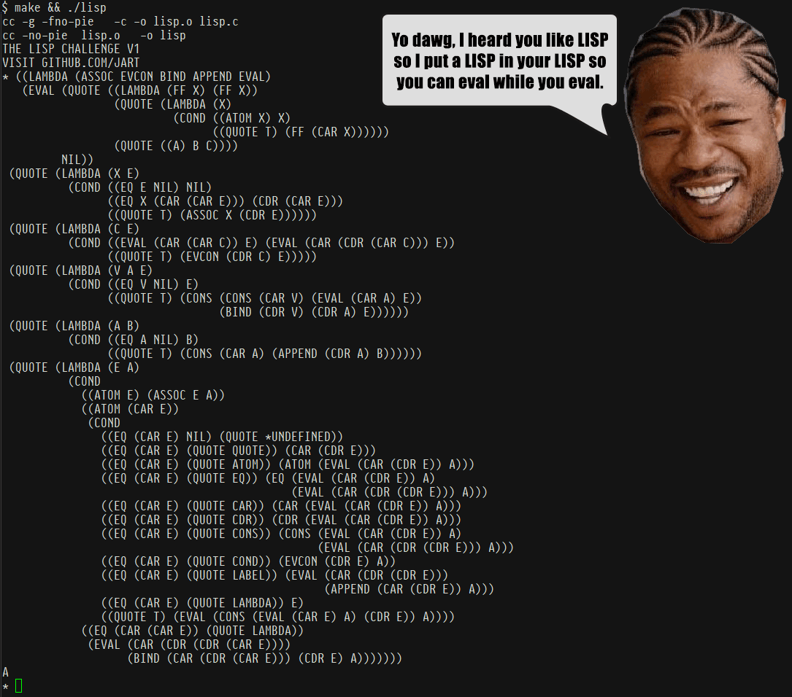
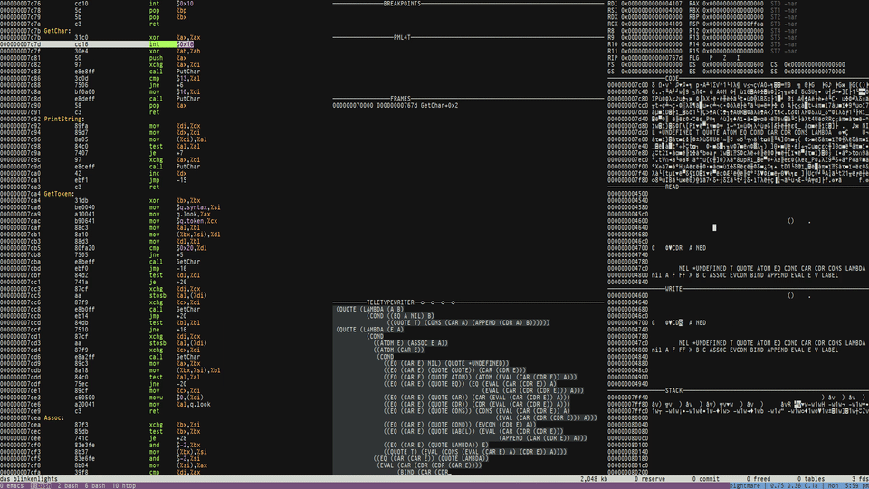

# sectorlisp

sectorlisp is a 512-byte implementation of LISP that's able to bootstrap
John McCarthy's meta-circular evaluator on bare metal.



## Overview

LISP has been described as the [Maxwell's equations of
software](https://michaelnielsen.org/ddi/lisp-as-the-maxwells-equations-of-software/).
Yet there's been very little focus to date on reducing these equations
to their simplest possible form. Even the [original LISP
paper](https://people.cs.umass.edu/~emery/classes/cmpsci691st/readings/PL/LISP.pdf)
from the 1960's defines LISP with nonessential elements, e.g. `LABEL`.

This project aims to solve that by doing three things:

1. We provide a LISP implementation that's written in LISP, as a single
   pure expression, using only the essential functions of the language.
   See [lisp.lisp](lisp.lisp). It's the same meta-circular evaluator in
   John McCarthy's paper from the 1960's, except with its bugs fixed,
   dependencies included, and syntactic sugar removed.

2. We provide a readable portable C reference implementation to show how
   the meta-circular evaluator can be natively bootstrapped on POSIX
   conforming platforms, with a pleasant readline-like interface. See
   [lisp.c](lisp.c).

2. We provide a 512-byte i8086 implementation of LISP that boots from
   BIOS on personal computers. See [sectorlisp.S](sectorlisp.S). To the
   best of our knowledge, this is the tiniest true LISP implementation
   to date.

<p align="center">
  
</p>

## Getting Started

See [lisp.lisp](lisp.lisp) for code examples that you can copy and paste
into your LISP REPL.

You can run the C implementation as follows:

```sh
$ make
$ ./lisp
```

After running `make` you should see a `sectorlisp.bin` file, which is a
master boot record you can put on a flopy disk and boot from BIOS. If
you would prefer to run it in an emulator, we recommend using
[Das Blinkenlights](https://justine.lol/blinkenlights/).

```sh
curl --compressed https://justine.lol/blinkenlights/blinkenlights-latest.com >blinkenlights.com
chmod +x blinkenlights.com
./blinkenlights.com -rt sectorlisp.bin
```

Alternatively you may use QEMU as follows:

```sh
qemu-system-i386 -nographic -fda sectorlisp.bin
```

Further information may be found on [our wiki](https://github.com/jart/sectorlisp/wiki).

## Demo

<p align="center">
  <a href="https://youtu.be/hvTHZ6E0Abo">
    </a>
</p>

The video above demonstrates how to boot sectorlisp in the blinkenlights
emulator, to bootstrap the meta-circular evaluator, which evaluates a
program for finding the first element in a tree.

You can [watch the full demo on YouTube](https://youtu.be/hvTHZ6E0Abo).
